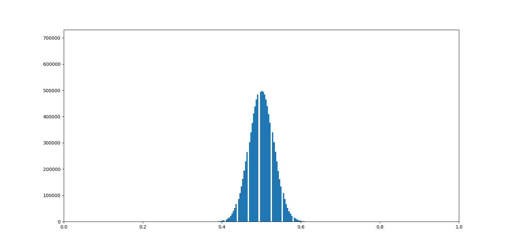
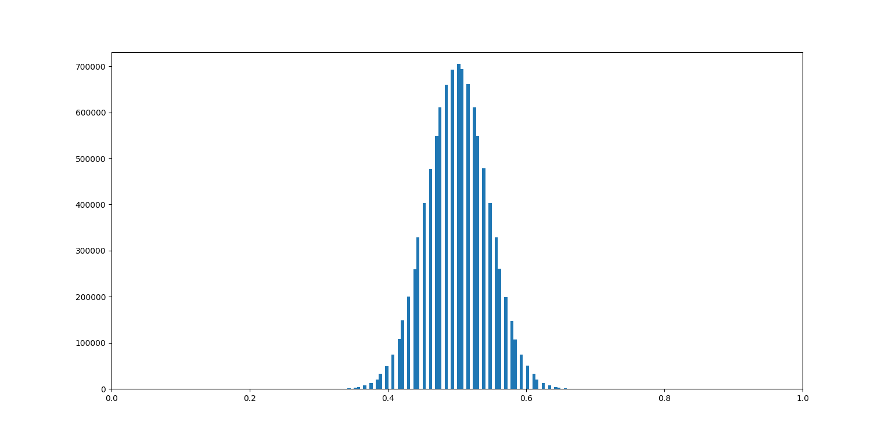

# Cryptographic Hash Avalanche Analysis

This project studies the avalanche effect: how changing one input bit changes the output bits of a cryptographic hash function. It compares MD5 and SHA-256 through reproducible Monte Carlo experiments and visualizes the distribution of normalized Hamming distances.

The original investigation ran experiments at up to **10 million trials** and generated several gigabytes of intermediate data. This repository keeps the reusable experiment code and selected final figures while excluding generated pickles.

## Why this matters

For an ideal avalanche response, one changed input bit should change roughly half of the digest bits. A distribution centred near 0.5 is consistent with that property, although this experiment alone does not establish that a hash is cryptographically secure.

## Selected results

### SHA-256



### MD5



## Run an experiment

The implementation uses Python's standard library.

```bash
python -m venv .venv
source .venv/bin/activate  # Windows: .venv\Scripts\activate
python -m pip install -e .
hash-avalanche --algorithm sha256 --trials 100000 --output results/sha256.json
```

Run the tests:

```bash
python -m unittest discover -s tests
```

## Method

For each trial:

1. Generate a reproducible random byte string.
2. Select and flip exactly one input bit.
3. Hash the original and modified inputs.
4. Count differing output bits.
5. Normalize the distance by the digest length.

The seed, number of trials and payload size are explicit command-line parameters.

## Interpretation and limitations

- MD5 is cryptographically broken and should not be used for security, regardless of its avalanche distribution.
- The experiment measures one statistical property and is not a security proof.
- The retained plots were produced by the historical experiment code; the modernized implementation is designed to make future runs easier to reproduce.
- Very large trial counts should write aggregated results rather than storing every intermediate value.

## Licence

MIT

