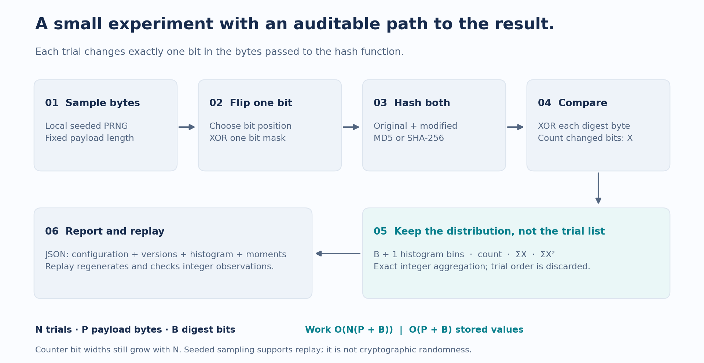
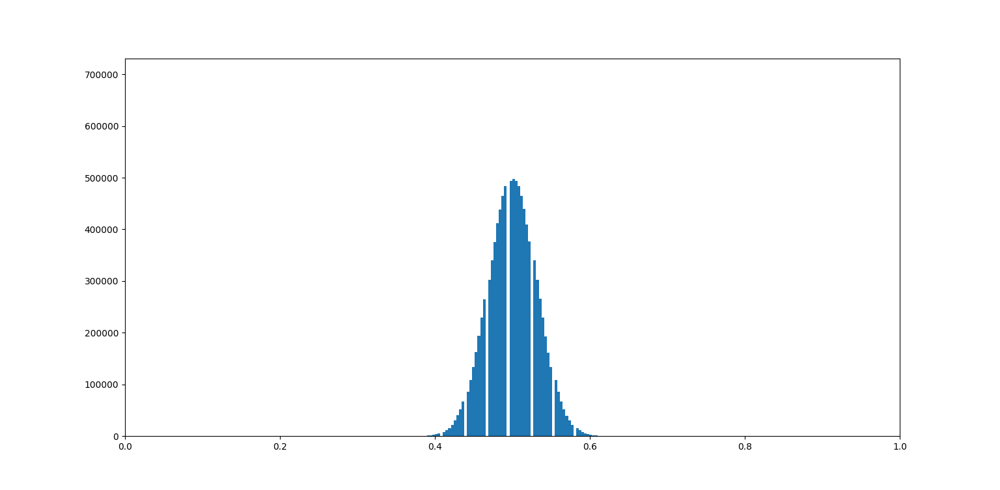
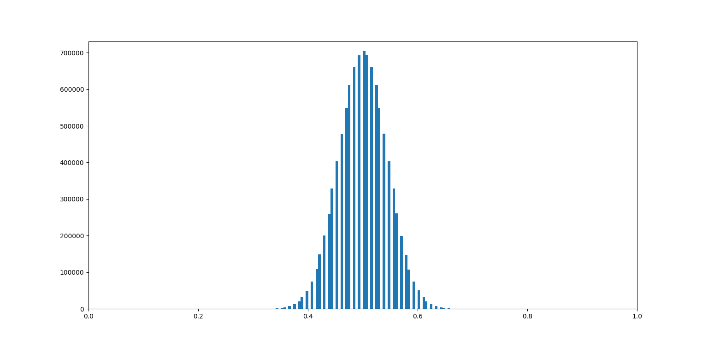

# Hash Avalanche Analysis

A reproducible Python experiment that makes a tiny input change measurable: flip **one bit**, hash both messages, and count the digest bits that change. It compares MD5 and SHA-256 while using a streaming histogram to keep the full distance distribution without retaining every trial.

This grew from my earlier investigation, which ran up to 10 million trials and produced several gigabytes of intermediate data. The maintained package develops that idea into a smaller, auditable experiment: an exact byte-level mutation, replayable JSON reports, independent reference checks and measured memory behaviour. The original figures are preserved separately with their methodological limitations.

| Experiment | Implementation | Committed evidence |
|---|---|---|
| MD5 and SHA-256 avalanche distributions | Python 3.11+, standard library only | Two replayable 100,000-trial reports |
| Streaming versus retained observations | Fixed histogram bins and exact integer moments | Raw runtime and memory measurements at 1k, 10k and 100k trials |
| Correctness and reproducibility | Bit invariants, independent reference, report replay | Tests on Linux and Windows |

[Run it](#run-and-replay) · [See the results](#current-results) · [Inspect the memory measurements](#measured-memory-behaviour) · [Read the implementation](src/hash_avalanche/experiment.py)

## What the code demonstrates

| Area | Implementation and evidence |
|---|---|
| Bit operations | Explicit LSB-first bit flip and bytewise Hamming distance; fixed digest vectors and bit-level properties in the [test suite](tests/test_experiment.py) |
| Bounded aggregation | Histogram, count, sum and squared sum; exact agreement with an independent retained-sample reference in the [accumulator](src/hash_avalanche/experiment.py) |
| Reproducibility | Seed, payload size, algorithm, experiment/sampler/schema versions, Python and OpenSSL metadata; [replay](src/hash_avalanche/cli.py) verifies integer observations |
| Statistical reporting | Mean, population spread, estimated standard error and an explicitly approximate confidence interval |
| Engineering | Input contracts, CLI tests, [cross-platform CI](.github/workflows/python.yml) and raw runtime/memory measurements |

## Inside one trial



The important invariant is **one changed bit in the actual bytes passed to the hash function**. The histogram contains `B + 1` possible distances for a `B`-bit digest: 129 bins for MD5 or 257 for SHA-256. Reports preserve the complete distribution and raw moments, while discarding individual trial order.

## Run and replay

Python 3.11+, standard library only:

```bash
python -m venv .venv
source .venv/bin/activate  # Windows PowerShell: .venv\Scripts\Activate.ps1
python -m pip install -e .
hash-avalanche --algorithm sha256 --trials 100000 --payload-bytes 32 --seed 20261002 --output result.json
hash-avalanche --replay result.json
python -m unittest discover -s tests -v
```

`--replay` uses the saved configuration, ignoring ordinary experiment flags, and verifies the histogram, digest width and raw moments. A mismatch is an error. This detects observational differences; it is not an authenticated signature. Exact replay is checked on the recorded environment; Python does not guarantee every RNG helper's behaviour across all future versions. The report retains runtime and sampler versions to make that boundary visible. See [Python's reproducibility notes](https://docs.python.org/3/library/random.html#notes-on-reproducibility).

Inputs must use `md5` or `sha256`, positive integer trial/payload counts and an integer seed. Booleans/floats are rejected by the Python API. Variable-output algorithms such as SHAKE are deliberately unsupported. `usedforsecurity=False` identifies this as a statistical experiment, as described in the [hashlib documentation](https://docs.python.org/3/library/hashlib.html).

## Method and memory tradeoff

Each trial draws a uniformly sampled fixed-length byte string from a local seeded PRNG, selects one bit position, flips it, hashes both messages and updates the distance histogram. Sampling uses `Random(seed).getrandbits(8 * payload_bytes)` encoded little-endian, followed by `randrange(8 * payload_bytes)`. It does not alter global RNG state and is not a source of cryptographic randomness.

For distance `x`, the accumulator updates `count`, `sum(x)`, `sum(x²)` and one histogram bin. Integer subtraction in the variance numerator avoids floating-point cancellation. Disjoint observation batches can be merged exactly. Repeating a seed repeats samples; merging duplicate streams does not create independent evidence. There is no distributed runner or checkpoint/resume feature here.

With `N` trials, `P` payload bytes and `B` digest bits, work is O(N(P+B)) and the number of stored values is O(P+B), independent of N. Counters are Python integers and grow logarithmically in bit width as N grows. Discarding individual distances means trial order cannot be recovered from the report, but every histogram-based statistic remains available.

Version 2 removes the old `result.distances` tuple. Use `result.distribution` or `result.histogram`; replay regenerates observations when needed. No giant raw-array compatibility mode is part of the library.

## Current results

Each row below is a **100,000-trial**, 32-byte-payload run with seed `20261002` on Python 3.12.14. These are observations from the maintained implementation.


*Discrete frequencies are shown as density steps, using each algorithm's own bin width of `1/B`; the dashed curves are an exact binomial reference. The visible range contains all nonzero observations. The reference describes an idealised independent-bit model, not a second measured run.*

| Algorithm | Normalized mean | Population standard deviation | Approximate 95% interval for the mean |
|---|---:|---:|---|
| MD5 | 0.500238 | 0.044395 | [0.499962, 0.500513] |
| SHA-256 | 0.500109 | 0.031239 | [0.499915, 0.500302] |

Complete histograms and replay configuration: [MD5 report](results/replayable/md5-100k-seed20261002.json), [SHA-256 report](results/replayable/sha256-100k-seed20261002.json).

The normalized distance for a trial is `Y = X/B`. For N observations, the report uses:

- Mean: `S / (N B)`.
- Population standard deviation: `sqrt((N S2 - S²) / N²) / B`.
- Estimated standard error: `sqrt((N S2 - S²) / (N² (N-1))) / B`, for N > 1.
- Approximate 95% interval: mean ± `1.959964 * standard_error`, clipped to [0,1].

Here `S = sum(X)` and `S2 = sum(X²)`. For one trial, standard error and the interval are `null`. The interval uses a normal approximation and treats trial observations as independent samples of this sampling process. It is not an exact finite-sample guarantee, and a narrow interval quantifies Monte Carlo uncertainty rather than modelling error, PRNG quality or cryptographic security.

An ideal independent-output-bit model has mean 0.5 and normalized standard deviation `1/(2*sqrt(B))`. Agreement with this aggregate model does not test every input/output bit pair, establish the strict avalanche criterion, or prove collision/preimage resistance. **MD5 has known collision weaknesses regardless of its avalanche distribution.**

## Measured memory behaviour


A recorded SHA-256 run at 100,000 trials used **19,232 bytes** of peak traced Python allocation for streaming aggregation versus **1,620,074 bytes** for a retained-distance reference. At 1,000 trials, those values were 17,980 and 34,698 bytes. The storage improvement comes from replacing an expanding trial list with fixed bins and a few counters.

| At 100,000 trials | Retained reference | Streaming histogram | What was kept identical |
|---|---:|---:|---|
| MD5 peak traced Python allocation | 1,619,754 bytes | 16,828 bytes | Exact histogram, sum and squared sum |
| SHA-256 peak traced Python allocation | 1,620,074 bytes | 19,232 bytes | Exact histogram, sum and squared sum |

*Both chart axes are logarithmic. Each marker is a measurement; connecting lines guide the eye. This is one host and three recorded sizes, without extrapolation.*

Untraced median runtime at 100,000 trials was 1.415 s streaming and 1.653 s retained on this host. Smaller cases do not uniformly favour streaming, and these measurements are not a general speed claim. Tracemalloc excludes native OpenSSL allocations and total process memory. See [raw samples](benchmarks/windows-python-2026-10-02.json) and [benchmark method](benchmarks/README.md).

## Engineering decisions

| Decision | Why it matters | Boundary |
|---|---|---|
| Change one bit after constructing the payload bytes | Makes the input perturbation exact and testable | Does not exhaust all possible input messages or input/output bit pairs |
| Keep integer counts and raw moments | Makes aggregation and merging exact before the final floating-point statistics | Trial order and individual payloads are not retained |
| Record sampler, schema and runtime versions | Makes a numerical result traceable to a specific experiment | Future Python RNG helper behaviour is not universally guaranteed |
| Check against a retained-distance reference | Tests whether the memory reduction preserves the observations | Agreement validates the implementations against each other, not cryptographic security |
| Separate timing from memory tracing | Avoids using tracing overhead as a runtime measurement | Native memory and whole-process RSS are outside the recorded measurement |

## Verification

Eleven tests cover known digests, exact bit locations, involution, Hamming metric properties, independent retained-reference agreement, merge equivalence, variance/standard-error calculations, invalid inputs, RNG isolation and CLI/report replay. CI runs Python 3.11 and 3.13 on Linux and Windows. A histogram near 0.5 is deliberately **not** used as the sole correctness test.

The new diagrams and charts are generated from committed evidence. Their [source, input checks and reproduction instructions](docs/visuals/README.md) are included; recreating the figures does not rerun or alter the experiment.

## Historical figures

These plots belong to the original investigation. Its generator mutated characters before UTF-8 encoding, which can change more than one bit in the bytes that are actually hashed. An exact one-hashed-input-bit invariant was therefore not established for those historical plots. Their sampling and retained-data workflow differ from the maintained implementation above; do not treat the two sets of results as directly comparable.

<details>
<summary>View the original investigation's plots</summary>





</details>

MIT licence for the implementation.
